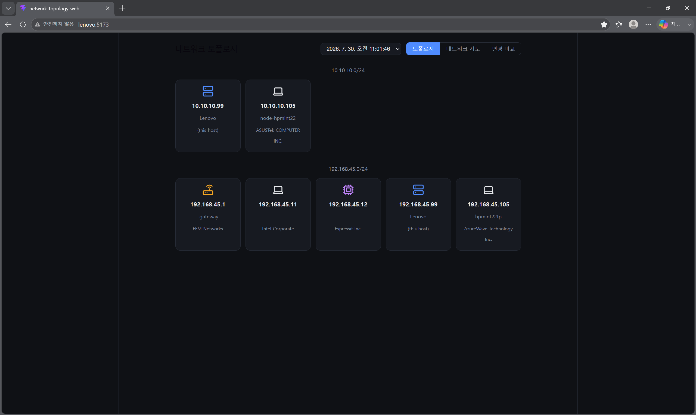

# network-topology-web

[🇰🇷 한국어](README.md) · 🇺🇸 English

A web UI for visualizing network topology built from IP/ARP scans. It reads scan results that [network-topology-api](https://github.com/kmw7117-dev/network-topology-api) has stored in InfluxDB v3, and renders the device list per subnet along with the L3 connection structure (gateway/bridge links).

## Screenshot



Devices are grouped by subnet (10.10.10.0/24, 192.168.45.0/24), and each card shows the IP, hostname, and vendor.

## Features

- **Topology**: device card view grouped by subnet (IP / hostname / vendor)
- **Network map**: graph view based on `@xyflow/react` — gateway-star edges per subnet plus cross-subnet bridge edges for multi-homed devices
- **Change comparison**: diff view of device changes between scan runs

## Tech stack

- Frontend: Vite + React + TypeScript, `@xyflow/react`
- Backend: [network-topology-api](https://github.com/kmw7117-dev/network-topology-api) (Node.js/Express)
- Data source: InfluxDB v3

## Running locally

```bash
npm install
npm run dev
```

The backend (network-topology-api) must be running first.
